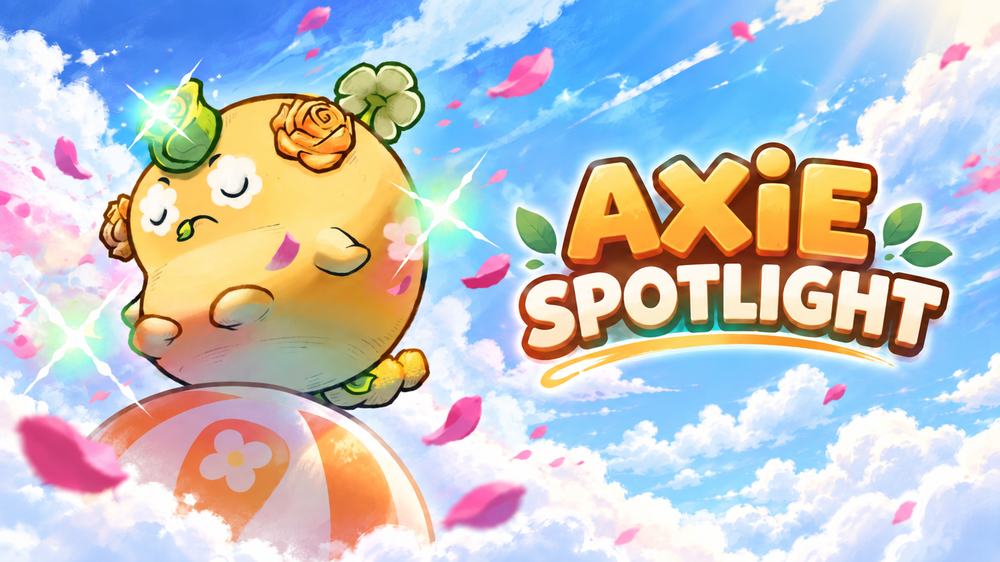

# Axie Spotlight

Axie Spotlight is an arcade performance game where you launch from a ball, chain aerial tricks and timed bounces, build a multiplier, and bank your score into Appeal before time runs out.

## **Axie Core interpretation:**

Axie Core is represented through character identity and gameplay feel rather than being treated only as a cosmetic layer. Puffy, Buba, and Pomodoro share the same core performance mechanics, but each has a distinct handling profile that changes characteristics such as speed, jump strength, and air control.

The goal is to support the idea that every Axie can have its own performance style. Players are encouraged to learn how each Axie feels rather than simply choosing a universally stronger character.

For this Round 1 prototype, the handling profiles are hand-authored and no wallet or platform account is required.

### **Playable build:**

https://mika-marcondes.github.io/axie-jam/

### **Supported platforms:**

Desktop web browsers with keyboard input.

## Controls

- `W A S D` — Move
- `Q / R` — Rotate camera
- `Left / Right` — Spin
- `Up` — Dive
- `Down` — Tuck
- `Space` — Jump / Bounce
- `Left Shift` — Boost
- `Esc` — Pause

### Sandbox controls

- `F1` — Toggle DevUI
- `R` — Restart scene

**How to start:**  
Open the playable browser build. No installation, account, or wallet is required.

From the main menu:

- Select Puffy, Buba, or Pomodoro.
- Choose **PLAY** for the timed progression mode.
- Choose **HOW TO PLAY** for the in-game tutorial.
- Choose **SANDBOX** to freely experiment with the movement system and physics tuning controls.

## Game loop

Perform aerial tricks to build score.

Well-timed bounces keep the performance line alive and increase the multiplier.

Landing normally banks the current line:

**Score × Multiplier = Appeal**

Reach the current Appeal target before the timer expires to clear the Spotlight and continue to a higher target.

**Win condition:**  
Reach each Spotlight's Appeal target before time runs out. Clearing a Spotlight resets the timer and raises the next Appeal target, allowing the run to continue.

If the timer reaches zero while a combo is still active, the player receives an overtime opportunity to finish and bank the line.

**Fail and retry:**  
If time expires and the required Appeal target is not reached, the run ends and a result screen provides a **Retry** option.

The pause menu also provides **Continue**, **Restart**, and **Return to Menu**.

## Sandbox

Sandbox mode removes the Appeal target and time limit.

The developer tuning panel is exposed so reviewers and players can experiment directly with movement, jump, bounce, boost, and trick parameters.

## Known issues

- Audio is not implemented in the current Round 1 prototype.
- The prototype is designed primarily for desktop browsers and keyboard input.
- Visual presentation and arena art are still prototype-level.

**Engine and version:**  
Godot 4.7.2 stable

## Material AI tools used

OpenAI ChatGPT was used during development for:

- Gameplay ideation and iteration
- GDScript implementation assistance
- Shader implementation assistance
- Debugging and code review
- Documentation

AI-assisted code and design suggestions were reviewed, tested, modified, and integrated by the developer.

**Generated components:**  
Portions of gameplay scripts, UI scripts, shaders, documentation, and design iteration were developed with AI assistance.

This README banner was generated with AI assistance using reference materials from the official competition media kit. It is included only for presentation purposes and does not represent original official key art from the organizers.

## Pre-existing work or starter forks

The project uses the official Sky Mavis Godot Axie starter resources as the basis for Axie character models and animation assets.

Starter repository:

https://github.com/axieinfinity/godot-axie-starter-3d

All original gameplay systems, ball controls, trick mechanics, scoring, bounce timing, character handling profiles, contest progression, sandbox tools, arena logic, menus, and UI integration for Axie Spotlight were built for this prototype.

## Asset sources and required notices

- Axie character models and animation assets: official Sky Mavis / Axie Infinity starter resources.
- Godot Engine and standard Godot runtime components.
- Remaining prototype materials, shaders, UI, and gameplay systems were created for this project.

## Dependencies

- Godot Engine 4.7.2 stable
- No external runtime backend
- No wallet integration
- No account login
- No multiplayer service
- No custom server required

The browser build is distributed as a static Godot Web export through GitHub Pages.
